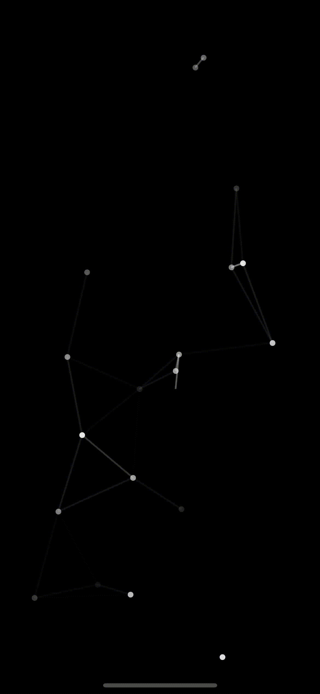

# SwiftUIParticles

Swift package for displaying particle animation effortlessly.

### Installation:

It requires iOS 13 and Xcode 11!

In Xcode go to `File -> Swift Packages -> Add Package Dependency` and paste in the repo's url: `https://github.com/ahmetkocu/ios-swiftui-particles`

### Usage:

import the package in the file you would like to use it: `import SwiftUIParticles`

