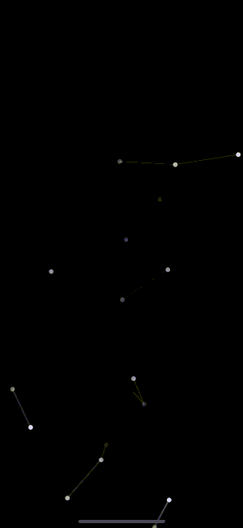

# SwiftUIParticles

Swift package for displaying particle animation effortlessly with SwiftUI

# Example

### Installation:

It requires iOS 13 and Xcode 11!

In Xcode go to `File -> Swift Packages -> Add Package Dependency` and paste in the repo's url: `https://github.com/ahmetkocu/ios-swiftui-particles`

### Usage:

import the package in the file you would like to use it: `import SwiftUIParticles`

# Inspired From

Thanks to [VincentGarreau](https://github.com/VincentGarreau) for sharing that awesome [javascript library](https://github.com/VincentGarreau/particles.js)

Thanks to [ibrahimsn98](https://github.com/ibrahimsn98) for sharing that awesome [android library](https://github.com/ibrahimsn98/android-particles)

# License
MIT